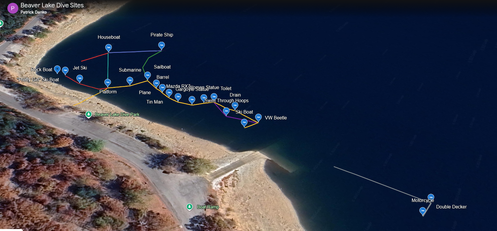
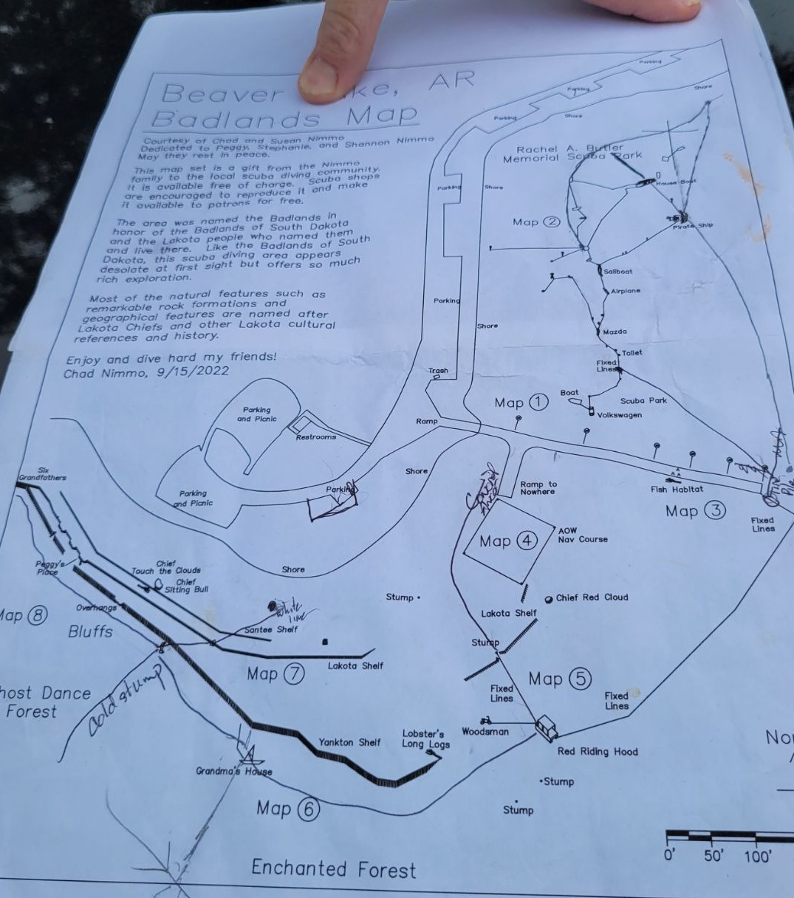
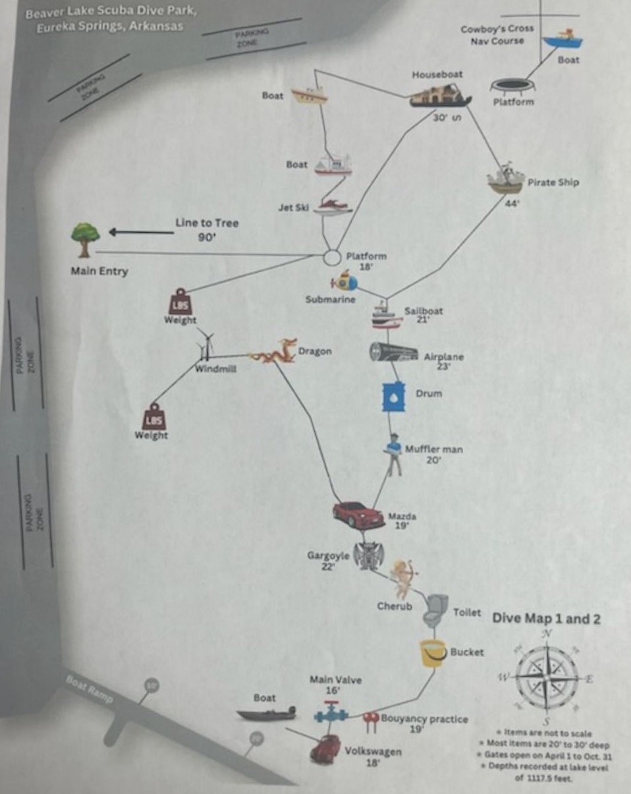
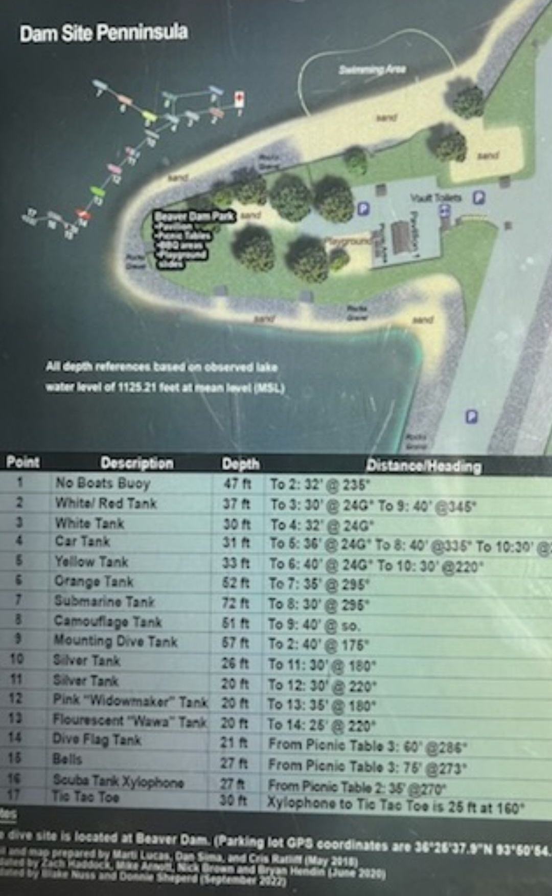

# Beaver Lake Dive Park Reference

**This is a personal reference project that pulls together existing maps and resources for divers visiting the Beaver Lake Dive Park near the dam in Arkansas.**

> ⚠️ None of this work is mine. I’m merely combining existing data to build a complete and modern map (someday). Credit goes to the original creators, especially those who have shared their maps and dives publicly.

---

## 📍 Google Earth Dive Map

Check out **Patrick Danko's Dive Map** on Google Earth:  
🔗 [tinyurl.com/beaverlake-divepark](https://tinyurl.com/beaverlake-divepark)

---

## 🗺️ Reference Images

| Image | Description |
|-------|-------------|
|  | **Isometric View** |
|  | **Line Map #1** |
|  | **Line Map #2** |
|  | **Dam Site Peninsula** |

---

## 🧭 Notes

- The **Beaver Lake Dive Park** is located near the **dam site peninsula**, a well-known and easily accessible dive site.
- Expect lots of recreational divers during the **warm water months** (spring to early fall), especially on weekends.
- That said, you'll usually find divers year-round—even in colder weather.

---

## 🔍 Want More Info?

This is not an official guide or training material. If you’re planning a dive:

- Search the web for **up-to-date dive briefings**, **conditions**, and **park rules**.
- Consult with **local dive shops** or instructors before diving.
- Stay safe and always dive within your limits.

---

## 🆘 Emergency Reference

📄 [Beaver Lake Emergency Action Plan](Emergency_Action_Plan_Beaver_Lake_AR.pdf)

---

*Last updated: 09/15/2025*
